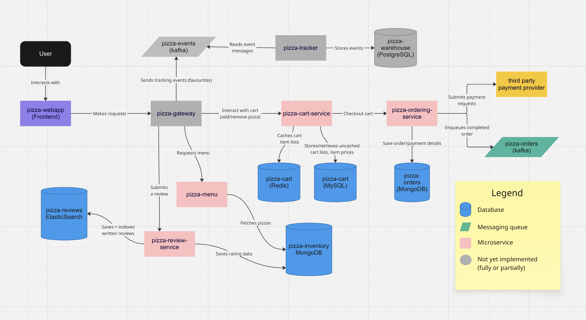

# pizza-project
A locally hostable pizza shop web app where I can practice and demonstrate various technologies in a microservice architecture.

### Disclaimer: 
Please understand that this project is likely not finished if you're reading this! This project is meant to be something that I can contribute to piecewise over time, with individually working microservices and functionalities that will eventually end up tying each other together. I will leave a checklist detailing things that I may plan on introducing or refactoring in the future.

Also understand that in some circumstances, I may opt to use a piece of technology that is slightly less viable than another purely for the purpose of demonstrating more coverage of a wider range of technologies. I will try to leave some remarks in these cases, but don't be too alarmed if you see a relational database squeezed in where non-relational would be better and so-on :smiley: .

## Architecture
Here is the most recent snapshot of what the entire architecture will look like, made in Miro. Most major interactions will be dictated, but some will be omitted to maintain clarity and readability.Note that revisions may be made as I make further development progress.

